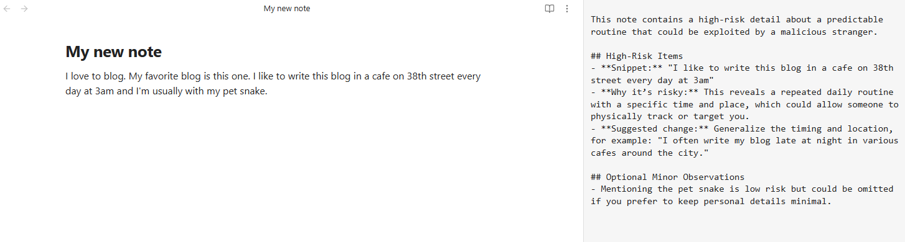
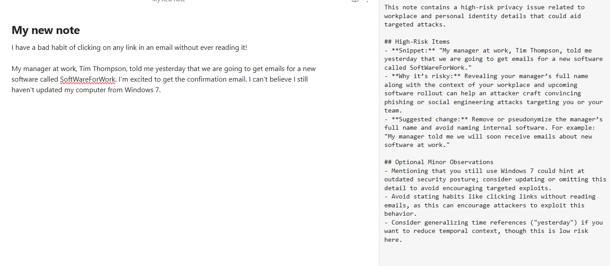
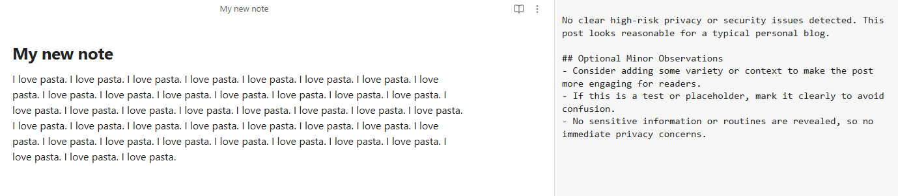

# AI Privacy Audit (Obsidian Plugin)

AI Privacy Audit is an Obsidian plugin that helps writers avoid unintentionally sharing sensitive or identifying information.  
With a single command, the plugin analyzes the current note using an OpenAI model and highlights only the most meaningful privacy or security risks—such as predictable routines, real names, home/work details, or exposed credentials.

It’s designed to support bloggers, digital gardeners, researchers, and anyone publishing personal writing.

- Adds a command: **Run privacy/security audit on current note**
- Sends the note text to an OpenAI model with a safety-focused system prompt
- Shows results in a side panel so you can edit and review side by side

# Setup via Obsidian Community Plugin

1. Install the plugin
2. Generate an OpenAI API Key [(instructions)](https://platform.openai.com/docs/quickstart) and add it in the plugin settings
3. Enable the plugin. From a note, open the command palette and run the "Privacy Audit" command. A summary of any privacy concerns will be generated and shown in a side panel.


## Installation (manual)

1. Download `main.js` and `manifest.json`.
2. Put them in a folder named `privacy-audit` inside your vault at:
   `.obsidian/plugins/privacy-audit/`
3. Enable the plugin in **Settings → Community plugins**.
4. Set your OpenAI API key in the plugin settings.

## Development

```bash
npm install
npm run build
```

The above commands will generate a new `main.js` file after any changes. You can then update the plugin folder with this file and reload the plugin in Obsidian.

## Examples

Below are example screenshots showing the plugin running inside Obsidian.

### Running the Audit from the Command Palette


---

### Catching a reveal of a personal routine



---

### Catching a reveal of corporate and device information



---

### Good note that passes checks



---